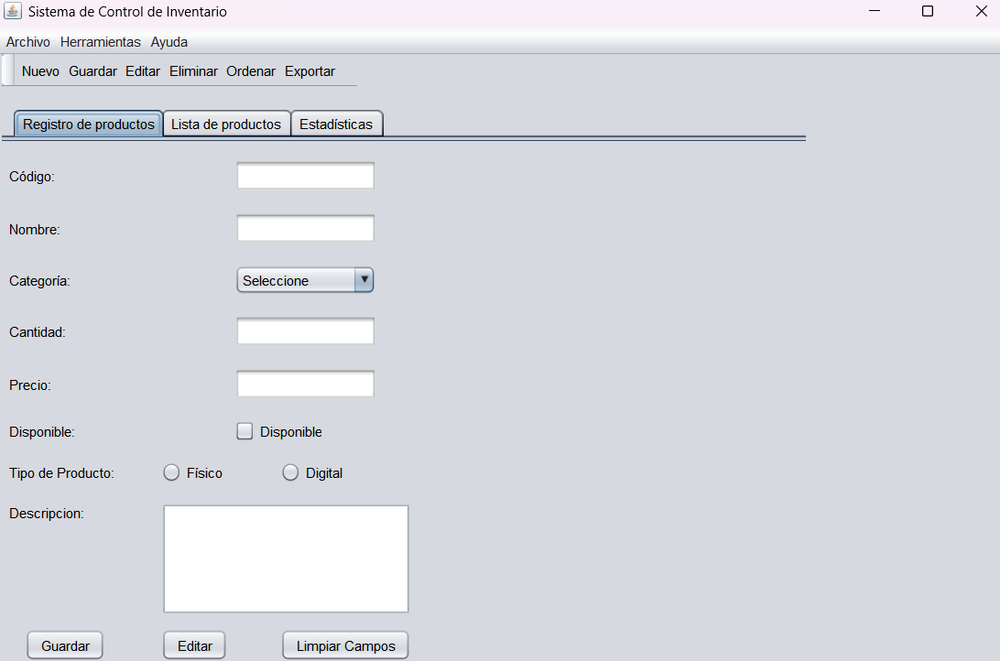
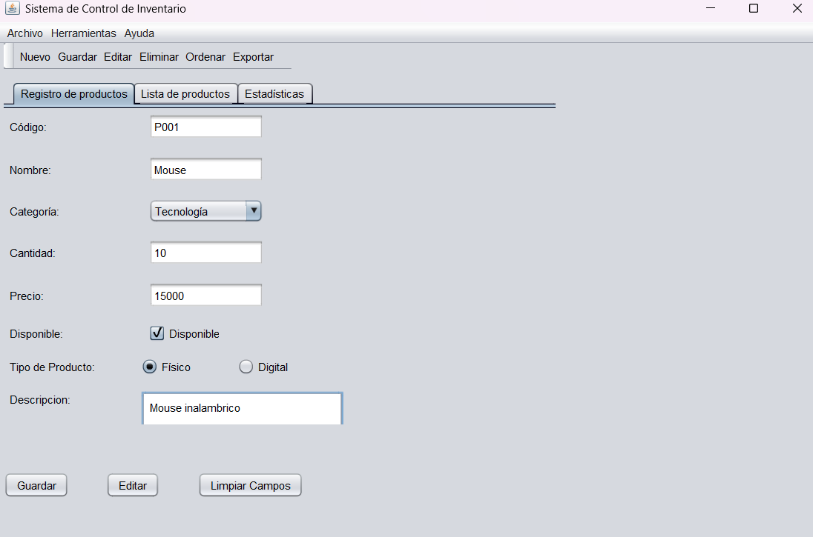
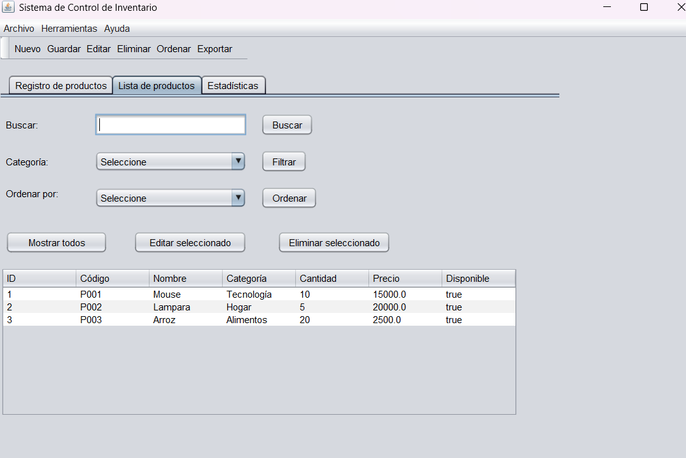
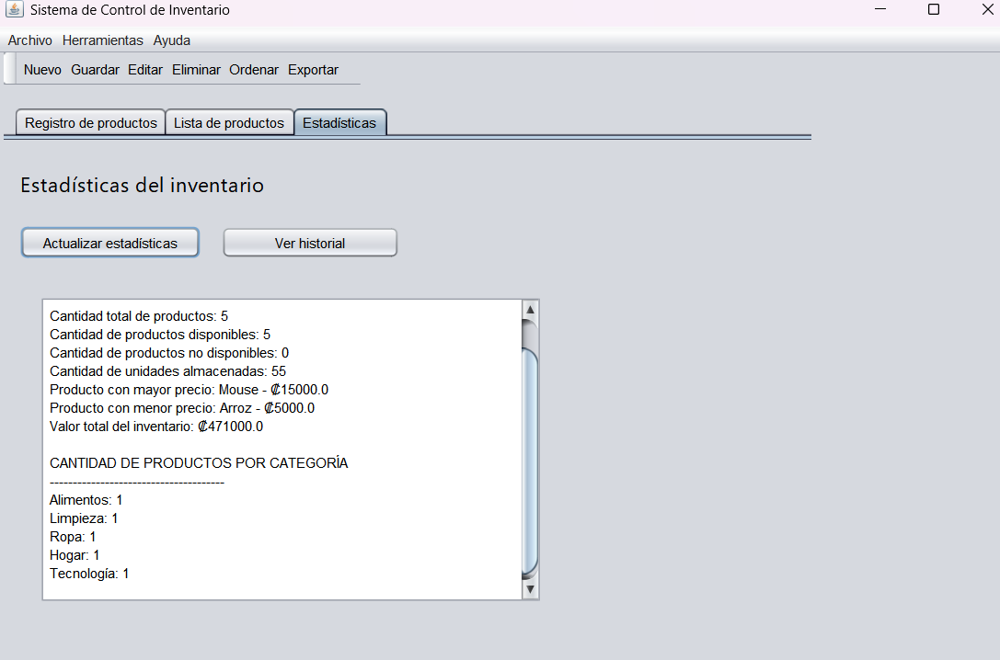
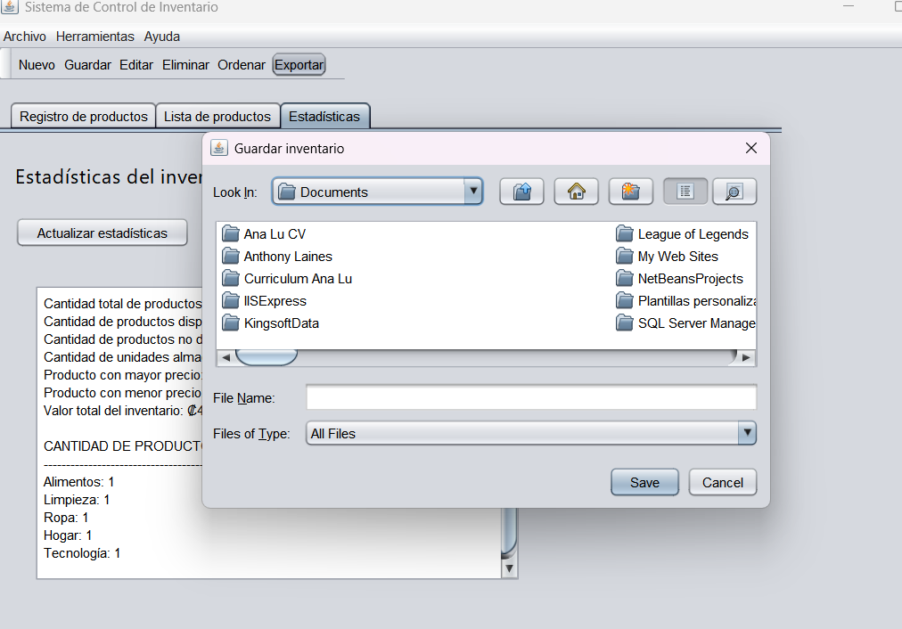

# InventarioProductos

# Sistema de Control de Inventario

## Estudiante

Ana Lucía Vargas Rodríguez

## Curso

Programación IV  
Universidad Internacional San Isidro Labrador  
Profesor: José Andrés Jiménez Zamora

## Descripción del sistema

El Sistema de Control de Inventario es una aplicación de escritorio desarrollada en Java Swing.  
El sistema permite registrar, editar, eliminar, buscar, filtrar, ordenar y exportar productos de un inventario.

La aplicación trabaja con una estructura por capas, separando el modelo, repositorio, lógica de negocio, presentación, utilidades y excepciones personalizadas.

## Requisitos para ejecutarlo

Para ejecutar el proyecto se necesita:

- Java JDK instalado.
- Apache NetBeans IDE.
- Proyecto Java con Swing.
- Clonar o descargar el repositorio desde GitHub.
- Abrir el proyecto en NetBeans.
- Ejecutar la clase `MainFrame.java`.

## Componentes Swing utilizados

El proyecto utiliza los siguientes componentes Swing:

- `JFrame` como ventana principal.
- `JMenuBar` para la barra de menú.
- `JMenu` para los menús Archivo, Herramientas y Ayuda.
- `JMenuItem` para las opciones del menú.
- `JToolBar` para la barra de botones principales.
- `JTabbedPane` para organizar las pestañas.
- `JPanel` para separar secciones.
- `JLabel` para mostrar textos.
- `JTextField` para ingresar datos.
- `JComboBox` para seleccionar categorías y opciones de ordenamiento.
- `JCheckBox` para indicar disponibilidad.
- `JRadioButton` para seleccionar el tipo de producto.
- `ButtonGroup` para agrupar los radio buttons.
- `JTextArea` para la descripción y las estadísticas.
- `JTable` para mostrar la lista de productos.
- `JScrollPane` para la tabla y áreas de texto.
- `JButton` para ejecutar acciones.
- `JOptionPane` para mostrar mensajes y confirmaciones.
- `JFileChooser` para seleccionar la ubicación del archivo exportado.

## Collections utilizadas

El proyecto utiliza las siguientes colecciones de Java:

- `List<Producto>` para almacenar los productos registrados.
- `Set<String>` para controlar los códigos de productos y evitar duplicados.
- `Map<String, Integer>` para contar la cantidad de productos por categoría.
- `Stack<String>` para guardar el historial de acciones realizadas.

## Excepciones personalizadas creadas

El sistema incluye excepciones personalizadas para manejar errores de forma ordenada:

- `DatoInvalidoException`
- `ProductoDuplicadoException`
- `ArchivoException`

Estas excepciones se utilizan para validar datos obligatorios, evitar productos duplicados y controlar errores durante la exportación de archivos.

## Instrucciones de uso

1. Abrir el proyecto en NetBeans.
2. Ejecutar la clase `MainFrame.java`.
3. En la pestaña **Registro de productos**, ingresar los datos del producto:
   - Código.
   - Nombre.
   - Categoría.
   - Cantidad.
   - Precio.
   - Disponibilidad.
   - Tipo de producto.
   - Descripción.
4. Presionar **Guardar** para registrar el producto.
5. Ir a la pestaña **Lista de productos** para ver los productos registrados.
6. Usar la búsqueda para buscar productos por nombre o código.
7. Usar el filtro para mostrar productos por categoría.
8. Usar el ordenamiento por nombre, precio o cantidad.
9. Seleccionar un producto de la tabla para editarlo o eliminarlo.
10. Ir a la pestaña **Estadísticas** para consultar los datos del inventario.
11. Usar el botón **Exportar** para guardar el inventario en un archivo.
12. Usar el menú o la barra de herramientas para acceder rápidamente a las funciones principales.

## Capturas de la aplicación

### Ventana principal

### Registro de productos

### Lista de productos

### Estadísticas

### Exportación de inventario

## Uso de Git

El proyecto fue desarrollado utilizando Git y GitHub.  
Se realizaron commits con mensajes claros durante el desarrollo.  
También se utilizó una rama adicional llamada `feature/inventario`, la cual debe integrarse a la rama principal mediante merge.
